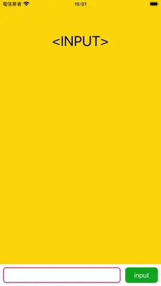

# WWExpandableTextView

[](https://developer.apple.com/swift/) [](https://developer.apple.com/swift/)  [](https://developer.apple.com/swift/) [](https://developer.apple.com/swift/)

## [Introduction - 簡介](https://swiftpackageindex.com/William-Weng)
- [TextView that can automatically change the height according to the number of words and lines.](https://medium.com/彼得潘的-swift-ios-app-開發問題解答集/自動更新高度的-cell-ios-16-uikit-新功能-c2de7adfe34c)
- [可以根據字數的行數，自動變更高度的TextView.](https://medium.com/jeremy-xue-s-blog/swift-認識-intrinsic-content-size-content-hugging-content-compression-4b76b8969dcc)



### [Installation with Swift Package Manager](https://medium.com/彼得潘的-swift-ios-app-開發問題解答集/使用-spm-安裝第三方套件-xcode-11-新功能-2c4ffcf85b4b)

```json
dependencies: [
    .package(url: "https://github.com/William-Weng/WWExpandableTextView.git", .upToNextMajor(from: "1.0.3"))
]
```

### [可用參數](https://ezgif.com/video-to-webp)
|參數|說明|
|-|-|
|text|文字|
|attributedText|屬性文字|

### [可用函式](https://ezgif.com/video-to-webp)
|函式|說明|
|-|-|
|configure(delegate:tag:lines:gap:)|參數設定|
|setting(font:textColor:backgroundColor:borderWidth:borderColor:)|文字框相關設定|
|updateHeight()|更新高度|

### [Example](https://blog.twjoin.com/ios-view-更新-從-setneedsdisplay-到-layoutsubviews-2e673359ccac)
```swift
import UIKit
import WWKeyboardShadowView
import WWExpandableTextView

final class ViewController: UIViewController {
    
    @IBOutlet weak var inputLabel: UILabel!
    @IBOutlet weak var shadowViewHeightConstraint: NSLayoutConstraint!
    @IBOutlet weak var expandableTextView: WWExpandableTextView!
    @IBOutlet weak var keyboardShadowView: WWKeyboardShadowView!
    
    override func viewDidLoad() {
        super.viewDidLoad()
        initExpandableTextViewSetting()
        initKeyboardViewSetting()
    }
    
    override func touchesBegan(_ touches: Set<UITouch>, with event: UIEvent?) {
        super.touchesBegan(touches, with: event)
        view.endEditing(true)
    }
    
    @IBAction func inputAction(_ sender: UIButton) {
        inputLabel.text = expandableTextView.text
    }
}

extension ViewController: WWKeyboardShadowView.Delegate {
    
    func keyboardViewChange(_ view: WWKeyboardShadowView, status: WWKeyboardShadowView.DisplayStatus, information: WWKeyboardShadowView.KeyboardInformation, height: CGFloat) -> Bool {
        return true
    }
    
    func keyboardView(_ view: WWKeyboardShadowView, error: WWKeyboardShadowView.CustomError) {
        print(error)
    }
}

private extension ViewController {
    
    func initExpandableTextViewSetting() {
        expandableTextView.configure(lines: 3, gap: 21)
        expandableTextView.setting(font: .systemFont(ofSize: 20), textColor: .black, backgroundColor: .white, borderWidth: 2, borderColor: .systemPink)
    }
    
    func initKeyboardViewSetting() {
        shadowViewHeightConstraint.constant = 0
        keyboardShadowView.configure(target: self, keyboardConstraintHeight: shadowViewHeightConstraint)
        keyboardShadowView.register()
    }
}
```
